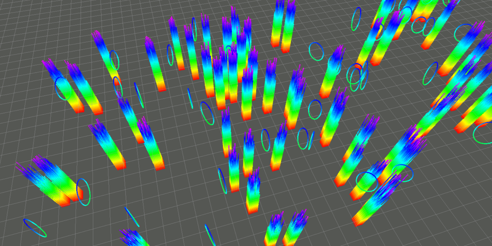

# Point Cloud Map Generation
This repository provides the point cloud map generation for various planing methods based on ROS.

## Installation
### Prerequisites
```
sudo apt install ros-noetic-pcl
```
### Setup and build
```
cd <workspace>/src
git clone git@github.com:duynamrcv/map_generator.git
cd <workspace>
catkin_make
```

## Demo
```
cd <workspace>
source devel/setup.bash
roslaunch map_generator single_run_in_sim.launch
```
