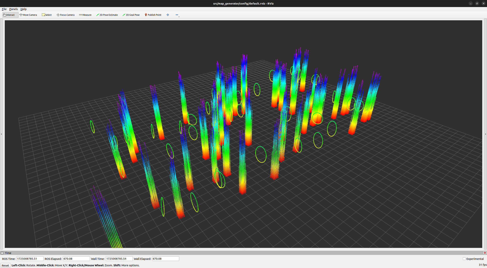
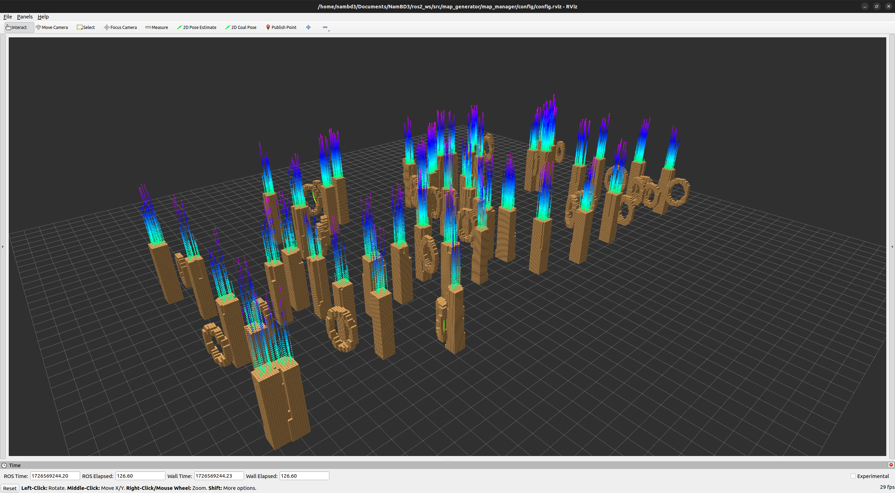

# Point Cloud Map Generation
This repository provides the point cloud map generation for various planing methods based on ROS.

## Installation
### Prerequisites
Install clang-format
```
sudo apt install clang-format-10
sudo ln -s /usr/bin/clang-format-10 /usr/local/bin/clang-format
```
Install needed library
```
sudo apt install ros-humble-pcl-ros
```
### Setup and build
```
cd <workspace>/src
git clone git@github.com:duynamrcv/map_generator.git
cd <workspace>
catkin_make
```

## Demo
```
cd <workspace>
source install/local_setup.bash
ros2 launch map_manager environment.launch.py
```


For example, to appear grid map of sensed map at drone position ``[10,0,2]``:
```
ros2 topic pub /odom nav_msgs/msg/Odometry "{header: {frame_id: ''}, child_frame_id: '', pose: {pose: {position: {x: 0.0, y: 0.0, z: 2.0}, orientation: {x: 0.0, y: 0.0, z: 0.0, w: 1.0}}}, twist: {twist: {linear: {x: 0.0, y: 0.0, z: 0.0}, angular: {x: 0.0, y: 0.0, z: 0.0}}}}"
```


## Motion planning - ERROR
